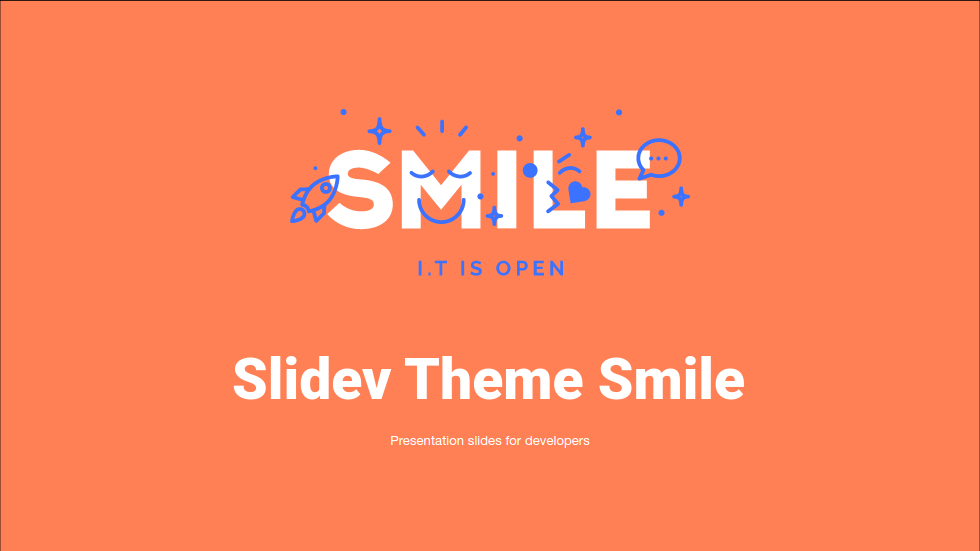
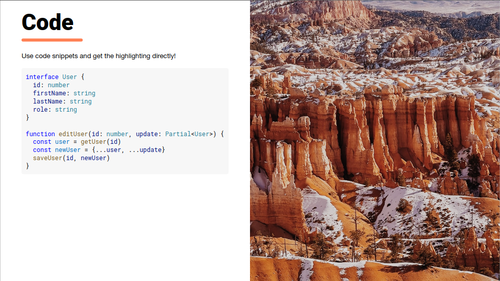

# slidev-theme-smile

[](https://www.npmjs.com/package/slidev-theme-smile)

Smile theme for [Slidev](https://github.com/slidevjs/slidev).

<!--
  Learn more about how to write a theme:
  https://sli.dev/themes/write-a-theme.html
--->

<!--
  run `npm run dev` to check out the slides for more details of how to start writing a theme
-->





## Install

Add the following frontmatter to your `slides.md`. Start Slidev then it will prompt you to install the theme automatically.

<pre><code>---
theme: <b>smile</b>
---</code></pre>

Learn more about [how to use a theme](https://sli.dev/themes/use).

## Components

This theme provides the following components:

### `Alert`

Display an alert box.

Usage:
```vue
<alert/>
```

Parameters:

* `type` (type: `'info' | 'warning' | 'error'`, default: `info`): Type for the alert

### `Icon` + `IconSprite`

Display a Smile icon.

Usage:
```vue
<icon-sprite/>
<icon icon="rocket-filled" />
```

You have to include the `IconSprite` component only once and at the beginning of your presentation.

Parameters:

* `class` (type: `string`): HTML class to apply to the icon
* `color` (type: `'primary' | 'secondary'`): Color of the icon
* `icon` (type: `string`, required): The icon name

### `Logo`

Display the Smile logo.

Usage:
```vue
<logo/>
```

Parameters:

* `color` (type: `'white' | 'primary'`, default: `'white`): The main color of the logo
* `iconColor` (type: `'primary' | 'secondary'`, default: `'primary'`): The color of the icons on the logo

## Contributing

- `npm install`
- `npm run dev` to start theme preview of `example.md`
- Edit the `example.md` and style to see the changes
- `npm run export` to generate the preview PDF
- `npm run screenshot` to generate the preview PNG
