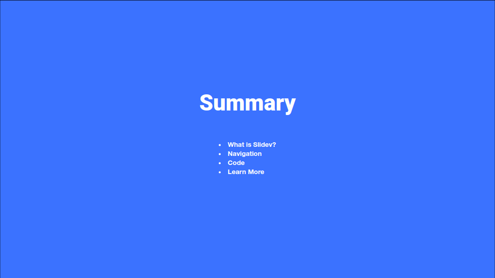

# slidev-theme-smile

[](https://www.npmjs.com/package/slidev-theme-smile)

Smile theme for [Slidev](https://github.com/slidevjs/slidev).

<!--
  Learn more about how to write a theme:
  https://sli.dev/themes/write-a-theme.html
--->

<!--
  run `npm run dev` to check out the slides for more details of how to start writing a theme
-->





## Install

Add the following frontmatter to your `slides.md`. Start Slidev then it will prompt you to install the theme automatically.

<pre><code>---
theme: <b>smile</b>
---</code></pre>

Learn more about [how to use a theme](https://sli.dev/themes/use).

## Components

This theme provides the following components:

### `Alert`

Display an alert box.

Usage:
```vue
<alert>This is an info</alert>
```

Parameters:

* `type` (type: `'info' | 'warning' | 'error'`, default: `'info'`): Type for the alert

### `DownloadButton`

Display a button you can click to download a file.

Usage (`demo.html` is in the `public` folder):
```vue
<DownloadButton filename="demo.html">Download code</DownloadButton>
```

Or:
```vue
<DownloadButton content="<h1>Hello world!</h3>" filename="demo.html">Download code</DownloadButton>
```

Parameters:

* `content` (type: `string`): Content of the file
* `filename` (type: `string`): Filename of the downloaded file and content file if `content` is empty.
* `type` (type: `string`, default `'text/plain'`): mime type of the content

### `Icon` + `IconSprite`

Display a Smile icon.

Usage:
```vue
<icon-sprite/>
<icon icon="rocket-filled" />
```

You have to include the `IconSprite` component only once and at the beginning of your presentation.

Parameters:

* `class` (type: `string`): HTML class to apply to the icon
* `color` (type: `'primary' | 'secondary'`): Color of the icon
* `icon` (type: `string`, required): The icon name

### `Logo`

Display the Smile logo.

Usage:
```vue
<logo/>
```

Parameters:

* `color` (type: `'white' | 'primary'`, default: `'white`): The main color of the logo
* `iconColor` (type: `'primary' | 'secondary'`, default: `'primary'`): The color of the icons on the logo

### `PaintWorklet`

Import a CSS paintWorklet module.

Usage:
```vue
<PaintWorklet src="https://unpkg.com/@houdini-modules/border-radius-reverse@0.0.1/border-radius-reverse.js"></PaintWorklet>
```

Parameters:

* `src` (type: `string`): Source URL of the worklet to load.

### `vScript`

Like the classical `<script>` tag.

Usage:
```vue
<vScript scoped type="module">
  import intersection from 'https://cdn.jsdelivr.net/npm/lodash-es@4.17.21/intersection.js';
  const result = intersection([1,2,3,4], [2,4,6,8]);
  document.querySelector('#result').innerText = JSON.stringify(result);
</vScript>
```

Parameters:

* `scoped` (type: `boolean`): Wrap the content of the `<script>` with an IIFE to create an isolated scope.
* Other attributes are passed down to the `<script>` tag.

## Layouts

### `two-cols-with-title`

Display two columns with a top content for the title.

Usage:
~~~md
---
layout: two-cols-with-title
---

## Top title

::left::

Left col content

::right::

Right col content
~~~

### `two-cols-demo`

Display code on the left and demo on the right.

Usage:
~~~md
---
layout: two-cols-demo
---

## Demo

::left::

```html
<button class="button" type="button">Click me</button>
```

::right::

<button class="button" type="button">Click me</button>
~~~

## Contributing

- `npm install`
- `npm run dev` to start theme preview of `example.md`
- Edit the `example.md` and style to see the changes
- `npm run export` to generate the preview PDF
- `npm run screenshot` to generate the preview PNG
